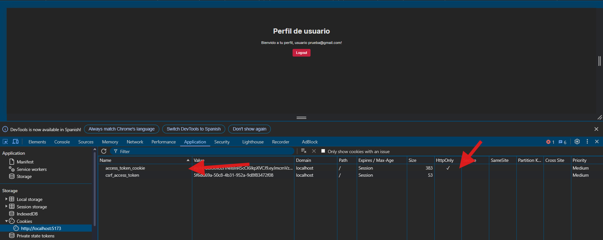
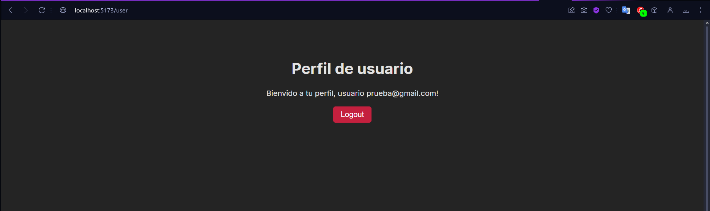
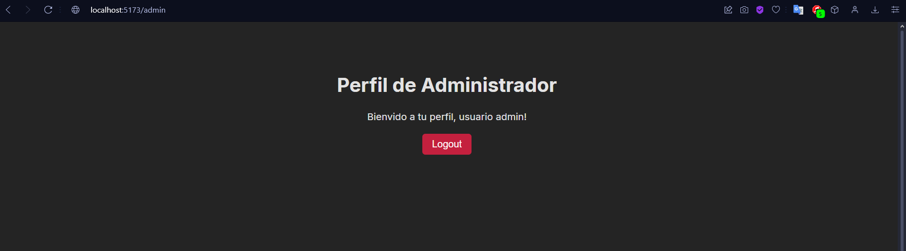

# Autenticación de usuarios JWT (React + Flask)
Desarrollado por Angel Torcelli

## Resumen
Este proyecto es un ejemplo de cómo se puede implementar un sistema de autenticación de usuarios utilizando JWT (JSON Web Token) en una aplicación web desarrollada con React y Flask.  
Las tecnologías utilizadas son las siguientes:
- VITE (React)
- Flask (Python)
- MYSQL

## Funcionalidades
- Registro de usuarios
- Inicio de sesión
- Rutas protegidas

### Registro de usuarios

### Inicio de sesión

Al iniciar sesión se obtiene un token que se almacena en una cookie. Este token es necesario para hacer peticiones a las rutas protegidas. En caso de que el token expire o sea inválido, el usuario será redirigido a la página de inicio de sesión. La cookie se maneja con la propiedad `httpOnly` para evitar que el token sea accedido desde el frontend.

### Rutas protegidas
En este caso se muestra una ruta que solo puede ser accedida por usuarios autenticados. En caso de que un usuario no autenticado intente acceder a esta ruta, será redirigido a la página de inicio de sesión.

La protección de rutas se realiza en el frontend, pero también el backend valida el token en cada petición para asegurarse de que el usuario está autenticado y tiene permisos para acceder a la ruta solicitada.

`url: /user`

Para simular el dashboard de un admin
`url: /admin`
